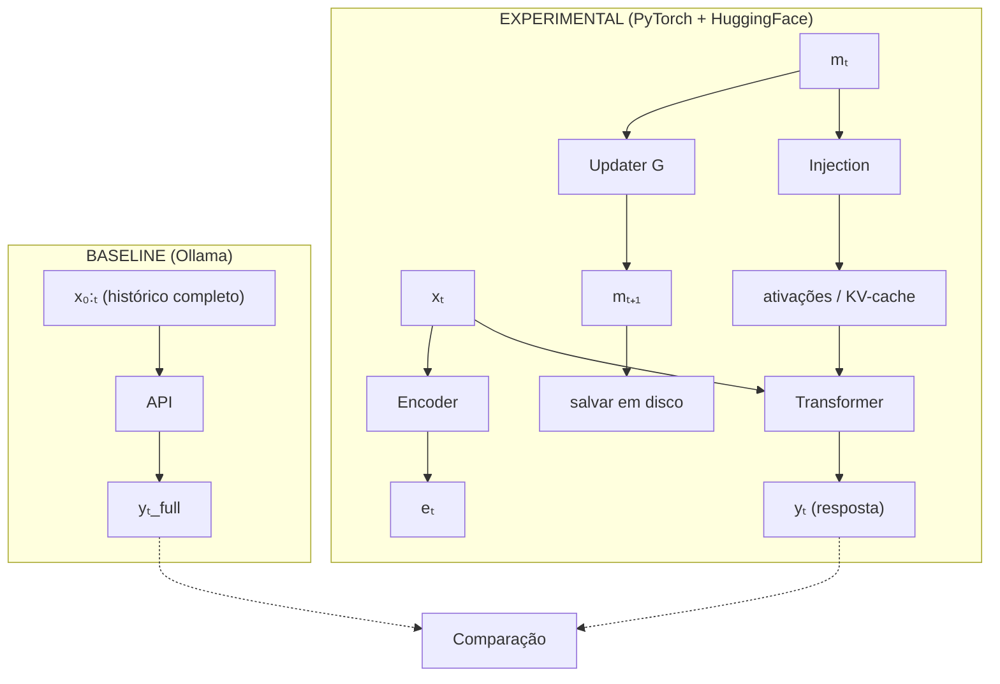

# lab-latent-memory

Pesquisa experimental: compressão recursiva de contexto para LLMs via estado latente persistente.

## Pergunta de pesquisa

É possível construir um estado latente persistente `mₜ ∈ ℝⁿ`, atualizado recursivamente
a cada interação, que substitua a reinjeção integral do histórico conversacional em uma LLM
e preserve poder inferencial comparável?

## Formulação

```
mₜ₊₁ = G(mₜ, xₜ₊₁)       # atualização da memória
yₜ₊₁ = F(xₜ₊₁, mₜ)        # inferência condicionada à memória
```

- `xₜ` — entrada no tempo t (nova mensagem)
- `mₜ` — estado latente acumulado até t
- `G`  — operador de atualização (objeto central da pesquisa)
- `F`  — inferência da LLM condicionada por mₜ

## Arquitetura



## Estrutura

```
src/
  model/       — carregamento do modelo HF, hooks de interceptação
  memory/      — objeto mₜ e operadores de atualização G
  injection/   — como mₜ entra no transformer (ativações, KV-cache)
  baseline/    — full-context via Ollama para comparação
  eval/        — métricas e benchmark
  runner/      — orquestração de conversas experimentais
experiments/   — scripts de experimentos
config/        — configuração
data/          — conversas de teste e estados de memória salvos
```

## Stack

- Python 3.11+
- PyTorch
- HuggingFace Transformers
- Ollama (baseline)

## Roadmap

- [ ] Carregar modelo HF com hooks de leitura/escrita
- [ ] Implementar mₜ básico (vetor + EMA)
- [ ] Injeção em ativações intermediárias (Porta 3)
- [ ] Injeção em KV-cache (Porta 3 variante)
- [ ] Baseline full-context via Ollama
- [ ] Benchmark conversacional
- [ ] Primeiro experimento comparativo
