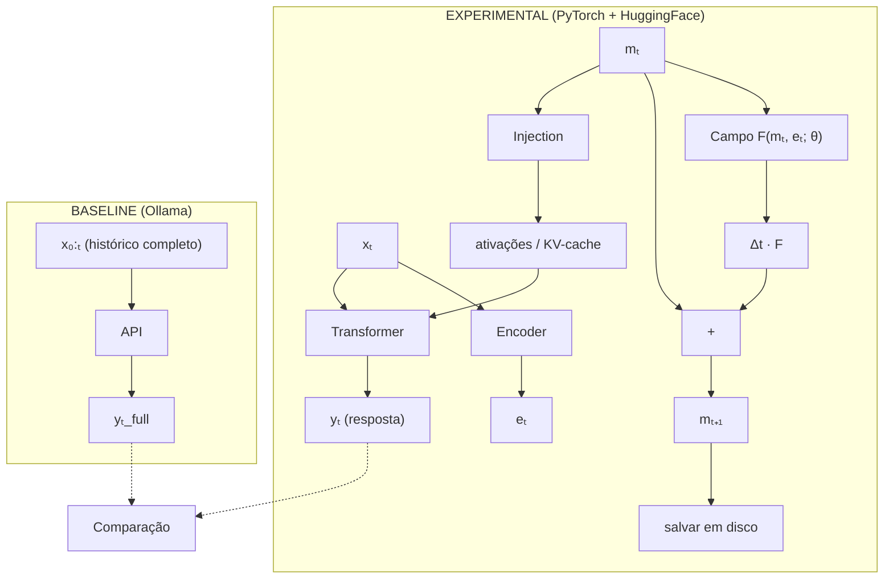

# lab-latent-memory

Pesquisa experimental: memória persistente como deformação aprendida do espaço de representação.

## Pergunta de pesquisa

É possível construir um estado latente `mₜ ∈ ℝⁿ`, atualizado por um campo vetorial
parametrizado, que substitua a reinjeção integral do histórico conversacional em uma LLM
e preserve poder inferencial comparável?

## Formulação

```
mₜ₊₁ = mₜ + Δt · F(mₜ, eₜ; θ)    # passo de integração no campo
yₜ₊₁ = LLM(xₜ₊₁ | mₜ)             # inferência condicionada à memória
```

- `xₜ` — entrada no tempo t
- `eₜ` — embedding extraído do modelo para xₜ
- `mₜ` — estado latente acumulado
- `F(·; θ)` — campo vetorial parametrizado (objeto central da pesquisa)
- `Δt` — passo de integração (controla estabilidade vs velocidade de adaptação)

## Hipótese pivot

A memória não é uma lista de experiências passadas comprimidas.
É a **geometria que o passado esculpiu no espaço latente** — fontes, sumidouros e rotações
que enviesam trajetórias de estados futuros.

Cada interação deforma o campo F. Queries futuras navegam esse campo deformado.
O que o modelo "lembra" não é conteúdo explícito — é para onde o campo direciona o estado.

## Arquitetura



## Operadores de atualização G

| Updater | Fórmula | Notas |
|---|---|---|
| `EMAUpdater` | `(1-α)·mₜ + α·eₜ` | Referência linear, sem parâmetros |
| `GRUUpdater` | GRU cell | Portas de esquecimento aprendidas |
| `MLPUpdater` | `mₜ + f([mₜ; eₜ])` | Residual, mais expressivo |
| `VectorFieldUpdater` | `mₜ + Δt·F(mₜ, eₜ; θ)` | Campo vetorial — hipótese principal |

## Backbone

Análise completa em [`docs/research/`](docs/research/).

| Papel | Modelo | Plataforma | Notas |
|---|---|---|---|
| Experimental (instrumentado) | `EleutherAI/pythia-410m` | HuggingFace | MHA puro, 154 checkpoints, projetado para pesquisa |
| Baseline (full-context) | `smollm2:1.7b` | Ollama | Mesmo modelo do lado HF, elimina confound |
| Unificado (HF + Ollama) | `HuggingFaceTB/SmolLM2-1.7B` | Ambos | Melhor opção quando identidade do modelo é crítica |
| Iteração rápida | `EleutherAI/pythia-160m` | HuggingFace | Sub-1 GB, 25-80 tok/s CPU |

> **Nota:** `loader.py` suporta atualmente `model.model.layers` (SmolLM2/Llama) e
> `model.transformer.h` (GPT-2). Para Pythia, é necessário adicionar suporte a
> `model.gpt_neox.layers`.

## Estrutura

```
src/
  model/       — carregamento do modelo HF, hooks de interceptação
  memory/      — objeto mₜ e operadores de atualização G
  injection/   — como mₜ entra no transformer (ativações, KV-cache)
  baseline/    — full-context via Ollama para comparação
  eval/        — métricas e benchmark
  runner/      — orquestração de conversas experimentais
experiments/
  v0_activation_inject/  — valida o pipeline (hooks + injeção + geração)
docs/
  pivot/       — documentos de decisão de design
  research/    — análises de backbone e arquitetura
config/        — configuração
data/          — conversas de teste e estados de memória salvos
```

## Stack

- Python 3.11+
- PyTorch
- HuggingFace Transformers
- Ollama (baseline)

## Comandos

```bash
# Instalar dependências
poetry install

# Rodar experimento v0 (valida o pipeline: hooks, injeção, geração)
poetry run python -m experiments.v0_activation_inject.run

# Baixar modelo baseline no Ollama
ollama pull smollm2:1.7b
```

## Roadmap

### Fase 1 — validação de encanamento (concluída)
- [x] Estrutura do projeto
- [x] `InstrumentedModel` com hooks de leitura/escrita
- [x] `MemoryState` — vetor persistente com save/load
- [x] `EMAUpdater`, `GRUUpdater`, `MLPUpdater`
- [x] `VectorFieldUpdater` — campo vetorial como operador G
- [x] `ActivationInjector` — injeção em hidden states (Porta 3)
- [x] `FullContextBaseline` — classe implementada
- [x] `ExperimentalRunner` — orquestrador do loop experimental
- [x] Pipeline rodando end-to-end com SmolLM2-1.7B

### Fase 2 — validação de função (agora)
- [ ] Subir Ollama com `smollm2:1.7b` e confirmar que `FullContextBaseline` responde coerentemente
- [ ] Montar benchmark mínimo de memória (3-5 casos: retenção de fato, resolução de referência, restrição)
- [ ] Script `experiments/v1_comparison/run.py`: sem memória vs EMA vs full-context, com score por categoria
- [ ] Adicionar métrica de trajectory stability (norma e cosseno de mₜ sucessivos)

### Fase 3 — experimento controlado (depois da régua estar pronta)
- [ ] Experimento com `VectorFieldUpdater` vs `EMAUpdater` no benchmark
- [ ] Suporte a `model.gpt_neox.layers` no `loader.py` (Pythia-410M)
- [ ] Injeção em KV-cache (`KVCacheInjector`)
